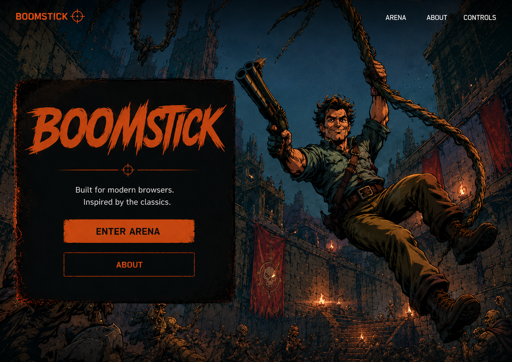

# Boomstick

> A modern browser-based first-person shooter built with React Three Fiber, Rapier, and TypeScript.

<p align="center">
  <a href="https://jlm429.github.io/boomstick/">
    
  </a>
</p>

<p align="center">
  <a href="https://jlm429.github.io/boomstick/"><strong>🎮 Play Boomstick</strong></a>
</p>

<p align="center">
  
  
  
  
</p>

---

## Overview

Boomstick is an original single-player FPS prototype that explores what modern browser games can look and feel like.

Built with React, React Three Fiber, and Rapier Physics, the project combines responsive first-person movement, lightweight combat, and a modern web application architecture into a fast-loading browser experience.

Boomstick is an exploration of AI-assisted software engineering.

---

## Play Online

**https://jlm429.github.io/boomstick/**

No installation required. Open the link and enter the arena.

---

## Features

- Modern browser-based first-person shooter
- React Three Fiber rendering
- Rapier physics
- Responsive WASD movement and mouse look
- Doom-inspired shotgun combat
- Hitscan weapon with recoil and reload mechanics
- Shotgun, reload, empty-trigger, and impact sound effects
- Breakable dynamic lighting and atmospheric arena
- Pause menu, HUD, and accessibility features
- GitHub Actions validation and GitHub Pages deployment

---

## Built With

- React 19
- TypeScript
- Vite
- Three.js
- React Three Fiber
- Rapier Physics
- Zustand
- Vitest
- ESLint
- Prettier

---

## Getting Started

Clone the repository:

```bash
git clone https://github.com/jlm429/boomstick.git
cd boomstick
```

Install dependencies:

```bash
npm install
```

Run the development server:

```bash
npm run dev
```

Build for production:

```bash
npm run build
```

---

## Quality Checks

```bash
npm test
npm run lint
npm run typecheck
npm run format:check
npm run build
```

---

## Project Documentation

Additional documentation can be found in the `docs` directory.

- Architecture
- Controls
- Development Guide
- Deployment Guide

---

## Roadmap

Current development focuses on expanding the arena while maintaining a lightweight browser experience.

Planned improvements include:

- Additional arenas
- Enemy AI
- Improved combat effects
- Expanded sound and music
- Enhanced weapon animations
- Expanded gameplay systems

---

## License

MIT License
